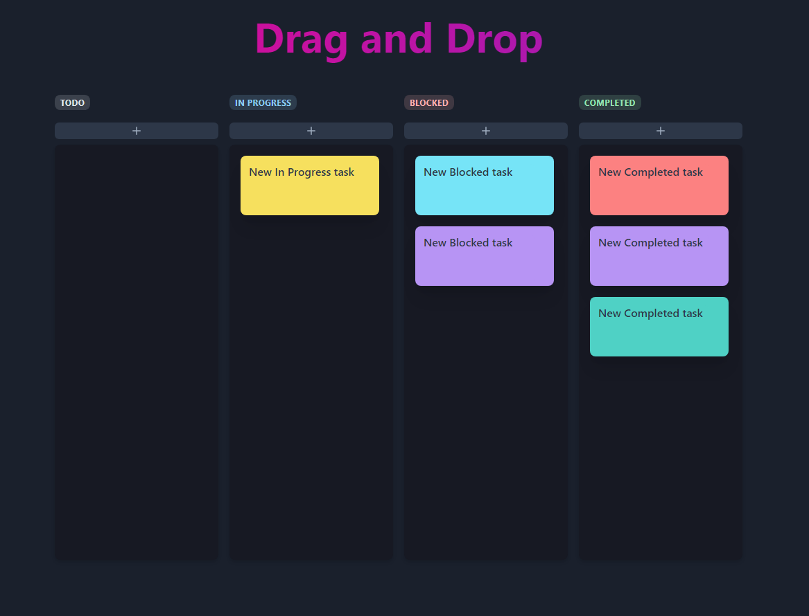

# Drag & Drop | React

## Description
This repository contains a Drag & Drop example to make a TODO List with React and Chakra UI.

## Characteristics

- Add Note in a column
- Edit text inside Note
- Move Notes between columns
- Delete Note

## Technology 

- [React](https://es.react.dev/)
- [Chakra UI](https://chakra-ui.com/)
- [React Beautiful DnD](https://github.com/atlassian/react-beautiful-dnd)

## Installation 

1. Clone this repository:
    `git clone https://github.com/AngelGuz/DragDrop.git`

2. Navigate to project folder:
    `cd DragDrop`

3. Install dependencies
    `npm install`

4. Run the app
    `npm start`

Open http://localhost:3000 to view it in the browser. 

> [!Note]
> This is only an example project to test and practice.